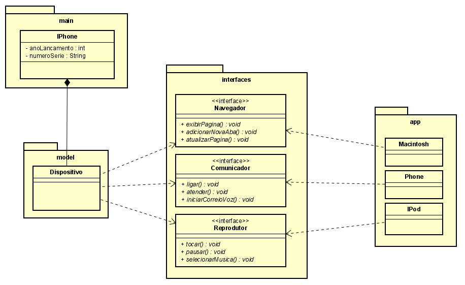

# Orientação a Objetos e UML: Diagramação de Classes do iPhone

**Desafio de projeto - Tópico: Orientação a Objetos e APIs Java**

Principais `temas` vistos:

- Dispositivo multifuncional x Funcionalidade única;

- Métodos de contratos (interface);

- Herança entre classes + atributos únicos (Classe Filha - [iPhone](./src/main/Iphone.java));

- Organização em pacotes ([main](./src/main/), [model](./src/model/), [interfaces](./src/interfaces/) e [app](./src/app/));

